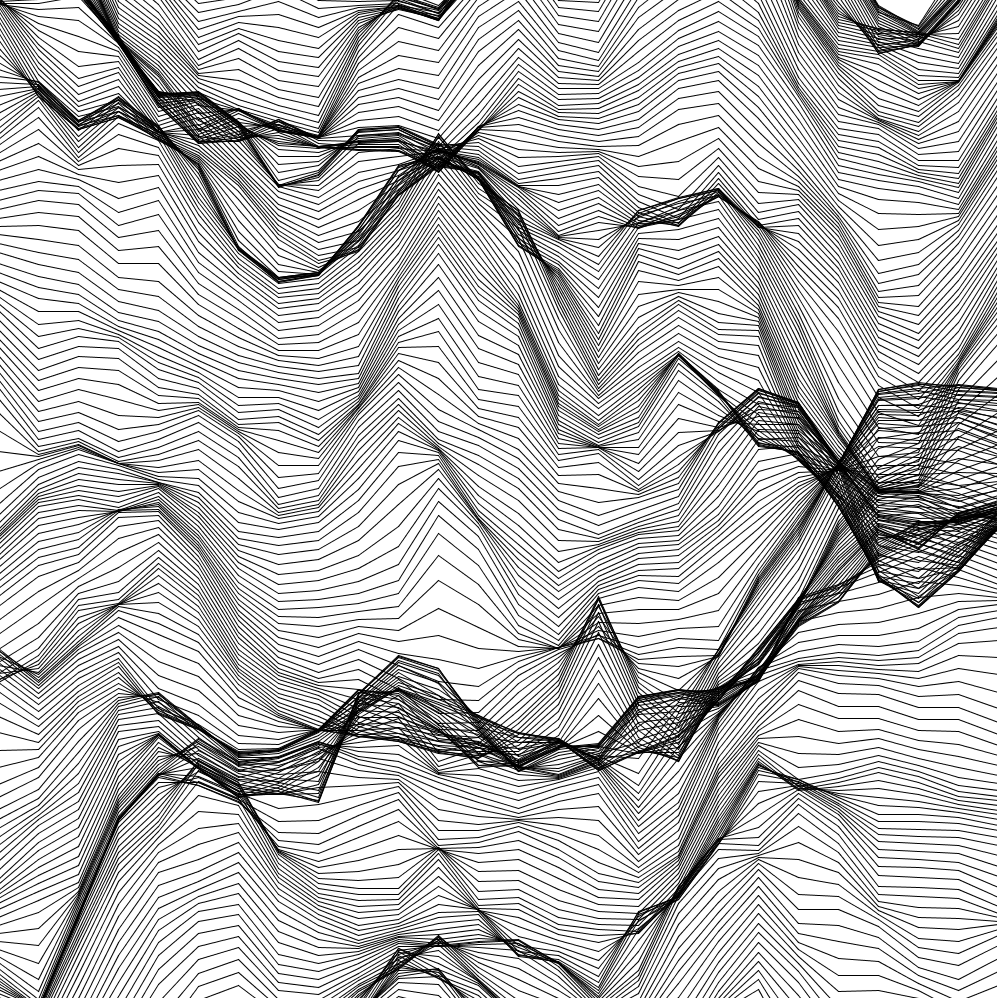
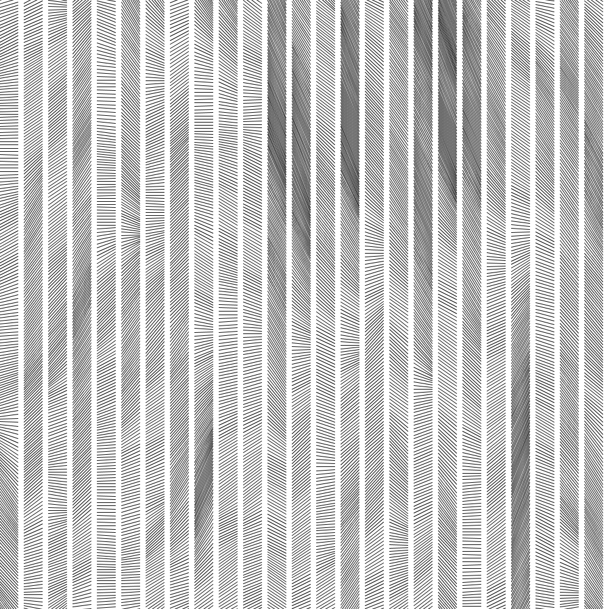
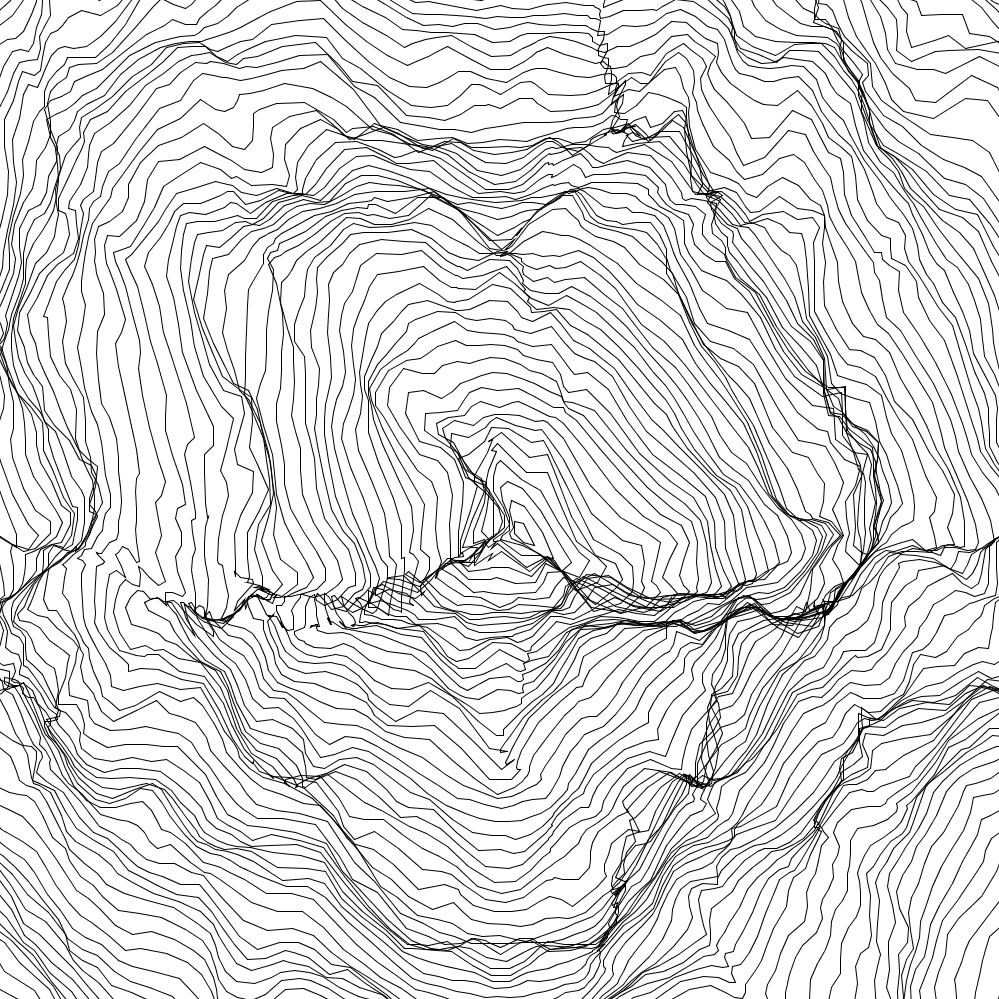
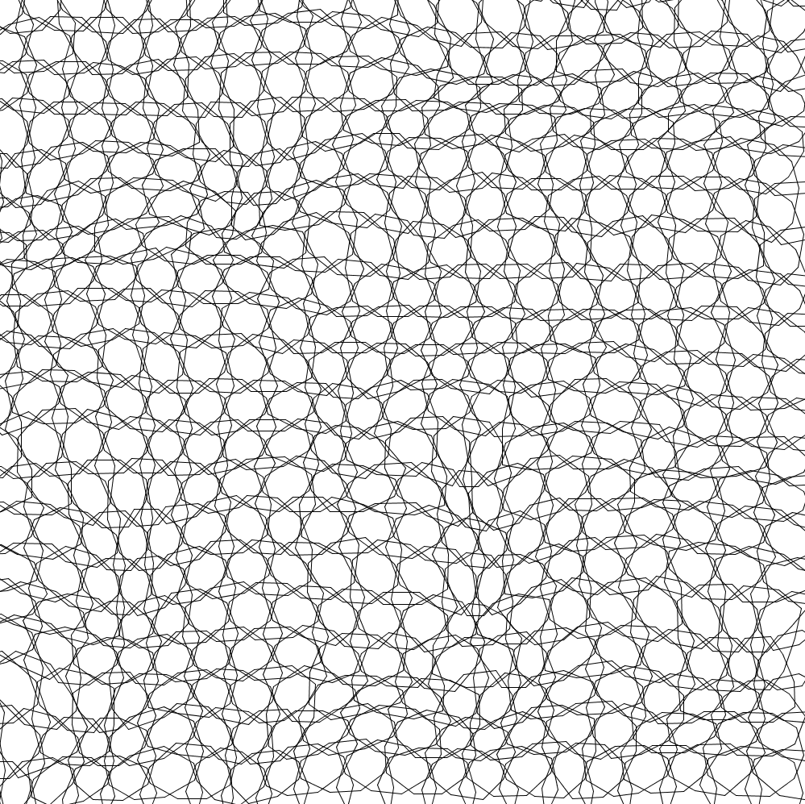
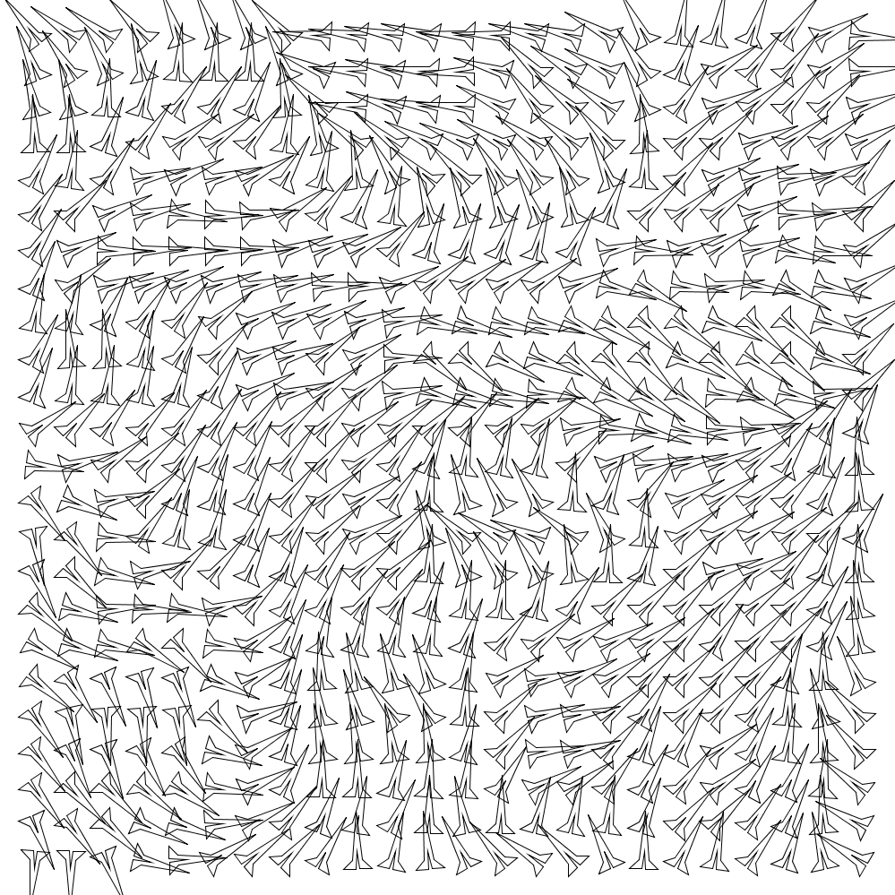
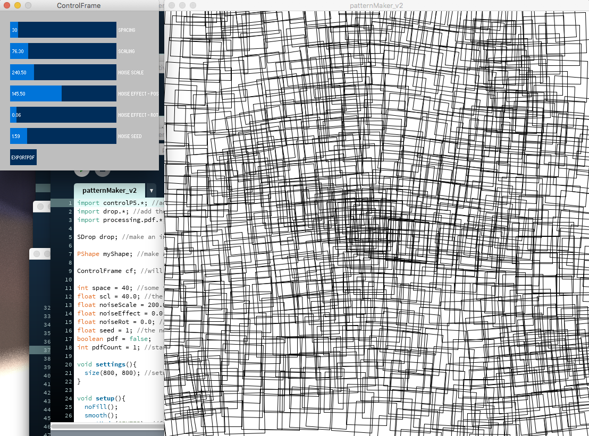

# generativeExamples

This is a collection of examples made in Processing that export pdfs for plotting. Across the examples are different methods to create patterns that are affected by Perlin noise. The patternMaker is a more robust application with a gui and the ability to drag and drop in svg files to try out many shapes.
### generativeHlines

### generativeHashMarks

### generativeCircles

### generativeDecagonGrid

### generativeArrowRotate

### patternMaker_v2
